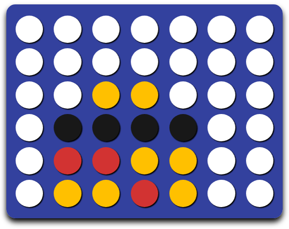

# Connect Four

A connect4 IA in JavaScript using reinforcement learning using **Monte Carlo Tree Search** and a **Multilayered Perceptron**.

## How it works?

It runs one **NodeJS** (exactly on v8.11.4). **No module needeed!**

First, the [engine](engine.js) implements the rules of the game. It represents the game, the board, checks for possible coups and for the winner. The file exports a method called `initGame` that returns an object with the following properties:

 - `board`: a 2D array containing the board; `0` for empty cases, `1` for the starting player, `2` for the other one
 - `player`: either `1` or `2`, the player who will play next
 - `full([column_index])`: returns whether the board is full, or if a specific column is full; it is used to detect draws
 - `coups()`: returns the list of possible coups (in columns indices)
 - `play(column_index)`: plays a coup, returns the evaluation of the board after the coup
 - `undo(colum_index)`: undo the last coup from a column (used for training, technical detail)
 - `evaluate()`: returns the id of the player that `won`, or `0` if none
 - `serial()`: returns a string representing the current board state

Then, a [Monte Carlo tree search](mcts.js) algorithm builds a tree to explore some coups. Pass the number of iterations (default `1`) as arguments. The tree is printed as a JSON, so redirect the output to save it.

```
node mcts.js 1000 > tree.json
```

The so-built tree will be used by a [multilayered perceptron](learn.js). Instanciated with `MLPClassifier()`, this object is used with two methods:

 - `fit(X, y, [eta=.1, threshold=.01, maxIter=100])`: train the classifier with the feature matrix `X` and the expected outputs `y`
 - `predict(X)`: returns the outputs of the feed-forward of a one row feature array `X`

The idea is then to train the classifier on the state discovered by the tree, to generalize the playing capacities. *Beware! The training takes a very long time!*

Finally, the trained classifier is used in a [script](play.js) were the user can play against the AI.

[](http://yohan.chalier.fr/games/connect4/)

[Soon to be implemented on an online GUI!](http://yohan.chalier.fr/games/connect4/)
